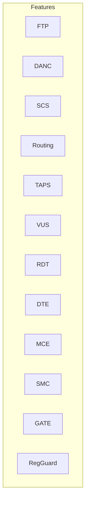
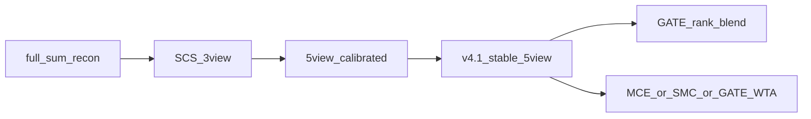
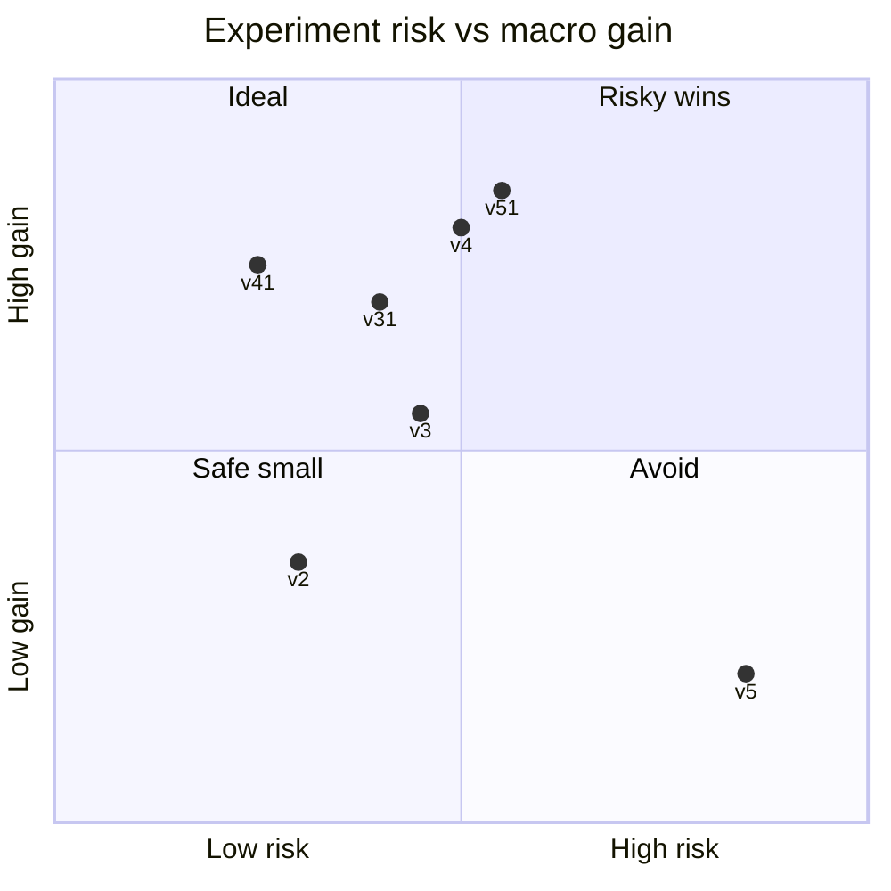
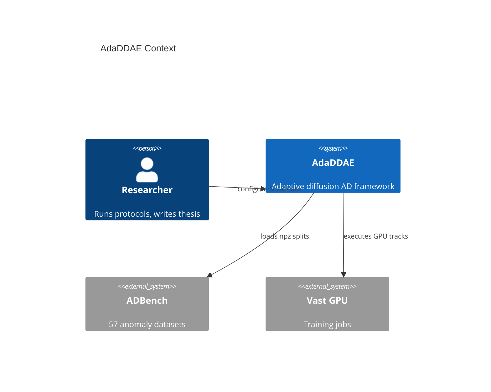
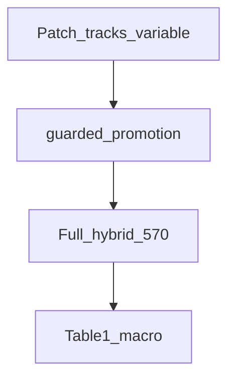

# Cross-Version Comparison Diagrams

## 1. Feature matrix

| Feature | DDAE | v2 | v2.1 | v3 | v3.1 | v4 | v4.1 | v5 | v5.1 |
|---------|------|----|------|----|------|----|------|----|------|
| FTP | | ✓ | ✓ | ✓ | ✓ | ✓ | ✓ | ✓ | ✓ |
| LF-DANC / MANS | | ✓ | ✓ | ✓ | ✓ | ✓ | ✓ | ✓ | ✓ |
| SCS / SSTS | | ✓ | ✓ | ✓ | ✓ | ✓ | ✓ | ✓ | ✓ |
| Policy routing | | | | ✓ | ✓ | ✓ | ✓ | ✓ | ✓ |
| TAPS / VUS / RDT / DTE | | | | ✓ | ✓ | ✓ | ✓ | ✓ | ✓ |
| Patch hybrid merge | | | ✓ | | ✓ | ✓ | ✓ | ✓ | ✓ |
| MCE | | | | | | | | planned | ✓ |
| SMC | | | | | | | | planned | ✓ |
| GATE | | | | | | | | ✓ v1 | ✓ v2 |
| Regression guard | | | | | | | | | ✓ |

## 2. Score path evolution

## 3. Research risk vs reward

## 4. End-to-end product view (v5.1)

## 5. Job accounting

