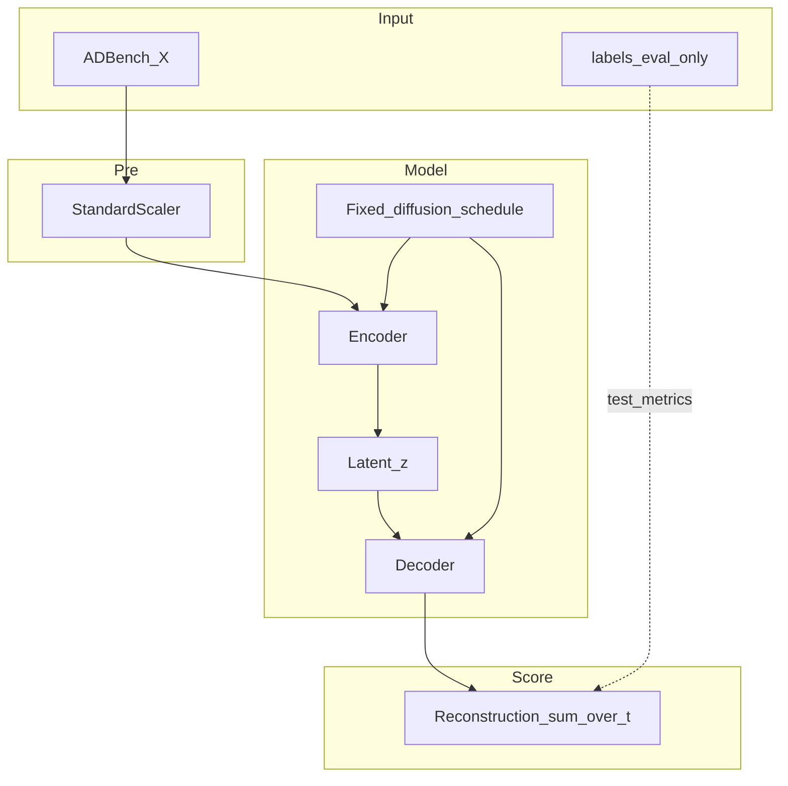
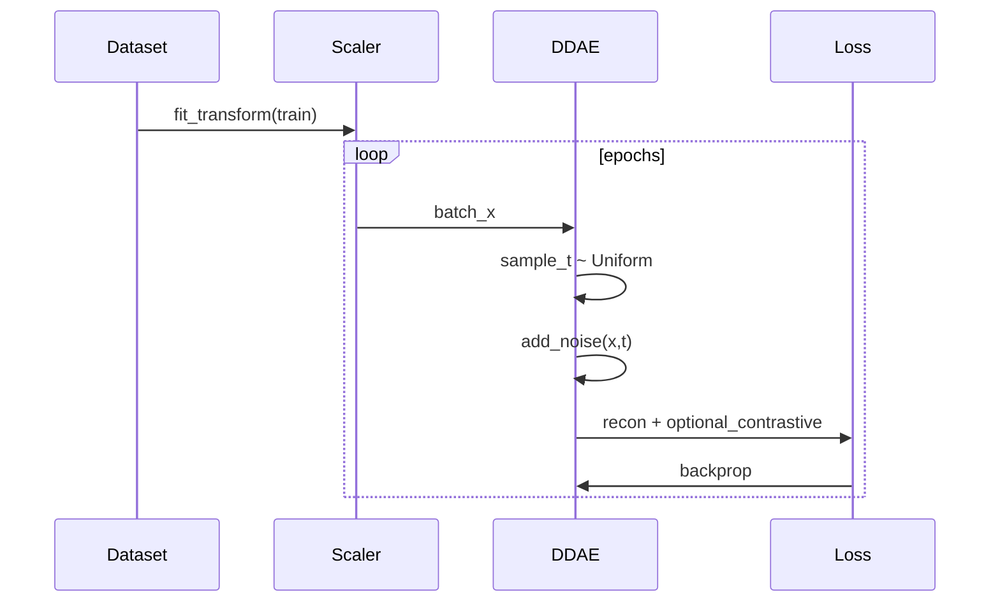
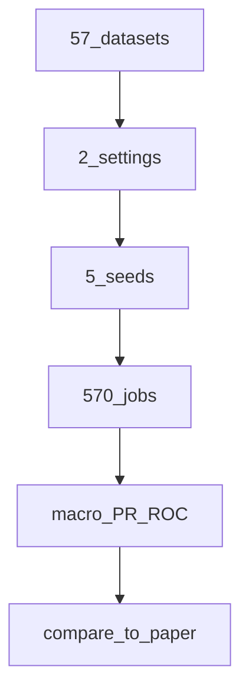
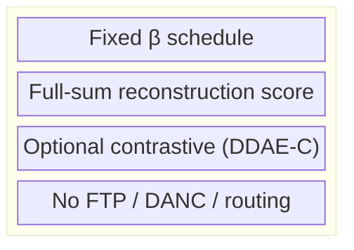
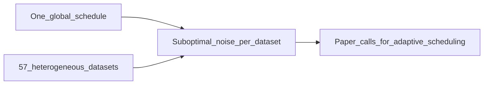
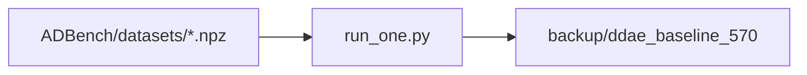

# DDAE Baseline — Diagram Pack

**Role:** Paper reproduction / G4 reference  
**Combined PR:** 46.69% (backup) · Paper Table-1: 47.07%  
**Artifact:** `backup/ddae_baseline_570/`

---

## 1. System architecture



## 2. Training flow



## 3. Inference / scoring flow

```mermaid
flowchart LR
  Xtest[X_test] --> Scale
  Scale --> Loop{for_all_t}
  Loop --> Noise[corrupt_x_t]
  Noise --> Pred[predict_x0]
  Pred --> Err[||x - xhat||]
  Err --> Sum[sum_over_t]
  Sum --> Rank[anomaly_rank]
```

## 4. Experiment protocol



## 5. Component stack



## 6. Design limitation (motivates AdaDDAE)



## 7. Data path on Vast


