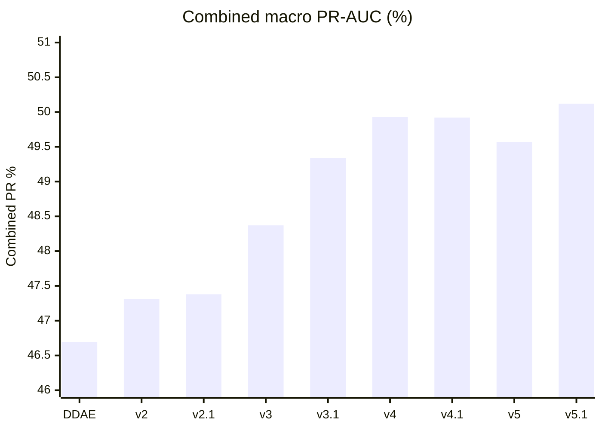
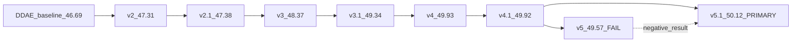
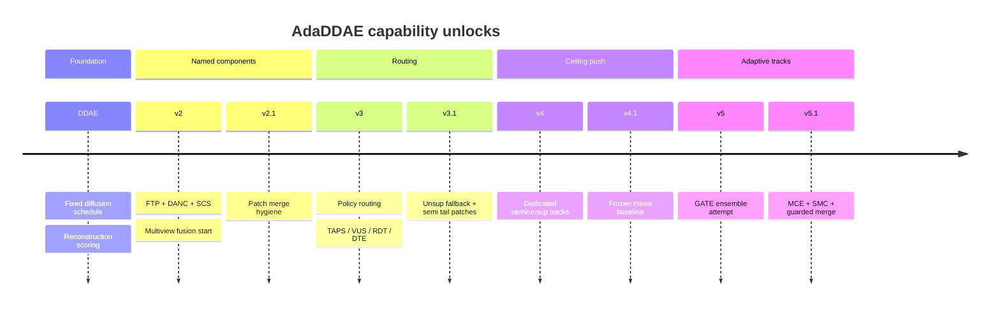
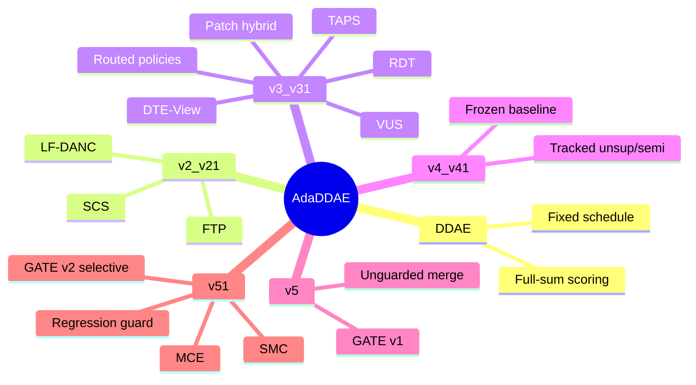
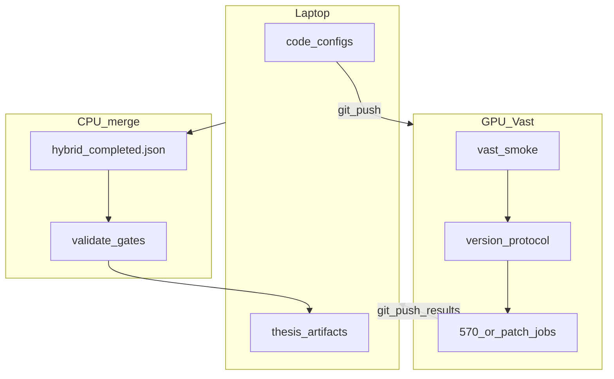
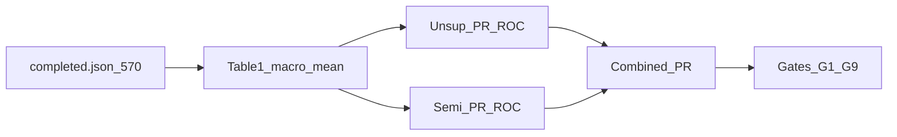

# AdaDDAE — Version Evolution Overview

## 1. Combined PR climb

## 2. Version lineage

## 3. Capability unlock timeline

## 4. What each version owns

## 5. Research workflow (all versions)

## 6. Evaluation contract (shared)

