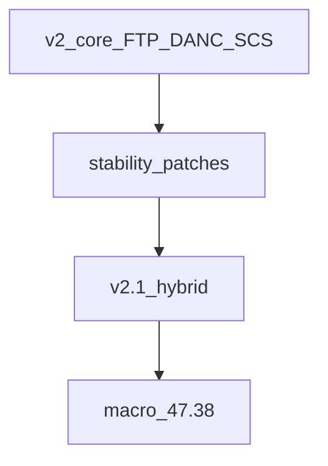
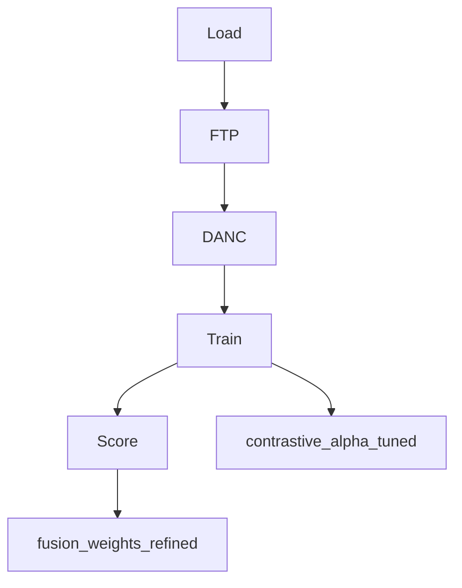
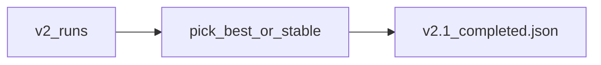
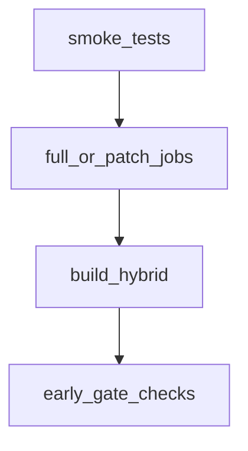
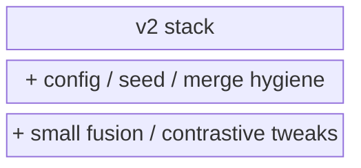
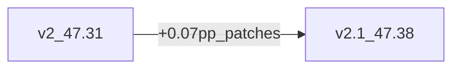
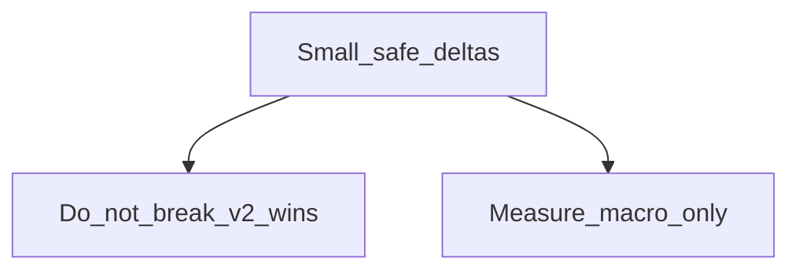

# AdaDDAE v2.1 — Diagram Pack

**Role:** Hygiene / patch refinement of v2  
**Combined PR:** 47.38%  
**Artifact:** `results/adadae_v2_1_hybrid/`

---

## 1. System architecture

## 2. Training flow (same core as v2)

## 3. Patch merge flow

## 4. Experiment protocol

## 5. Component stack

## 6. Delta vs v2

## 7. Design principle

