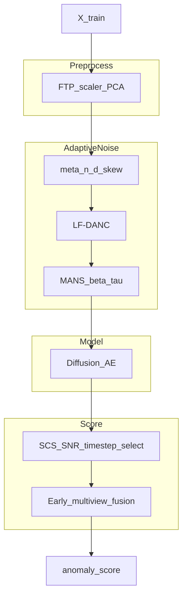
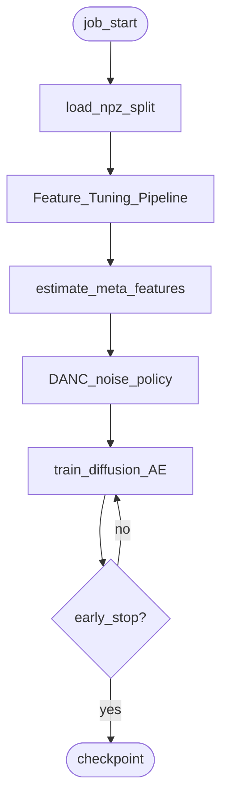
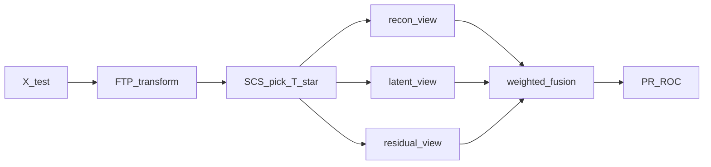
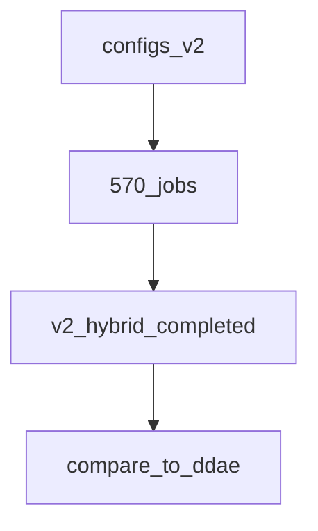
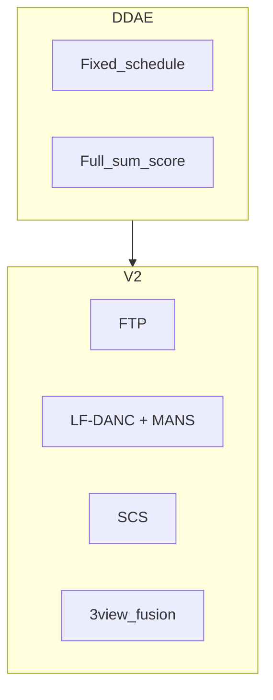
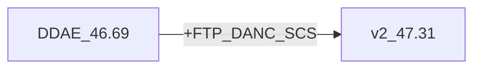
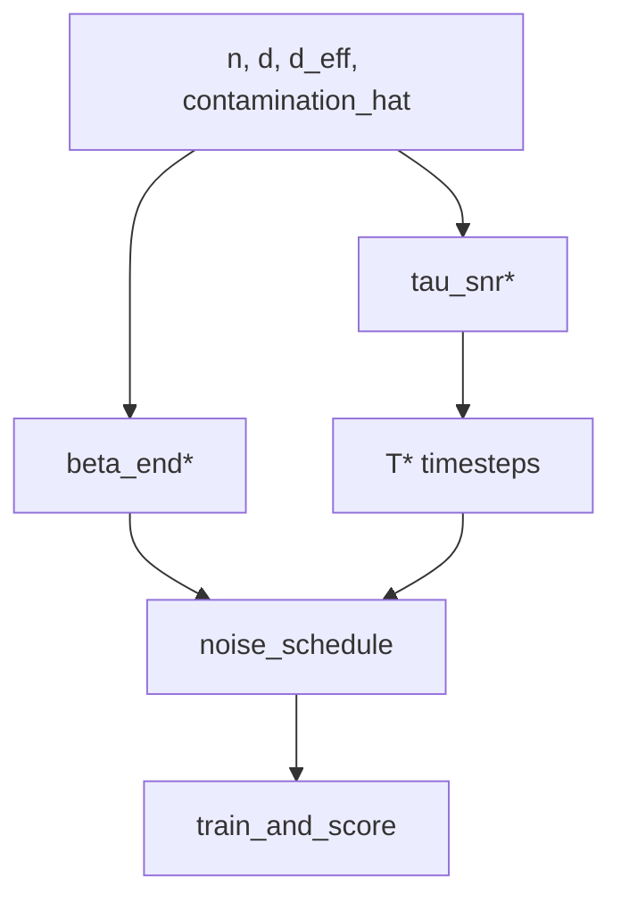

# AdaDDAE v2 — Diagram Pack

**Role:** First named-component hybrid  
**Combined PR:** 47.31%  
**Artifact:** `results/adadae_v2_hybrid/`

---

## 1. System architecture

## 2. Training pipeline

## 3. Scoring flow

## 4. Experiment protocol

## 5. Component stack vs DDAE

## 6. Delta vs DDAE

## 7. Design diagram — adaptive schedule

