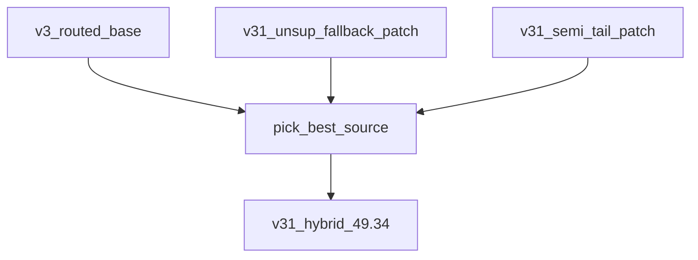
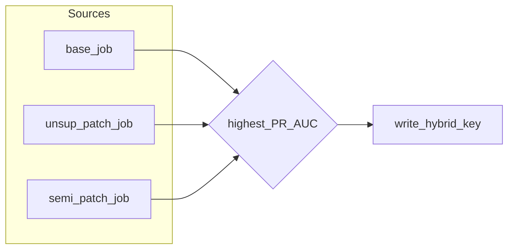
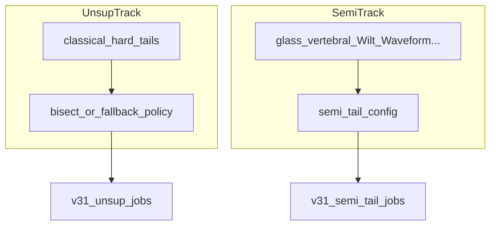
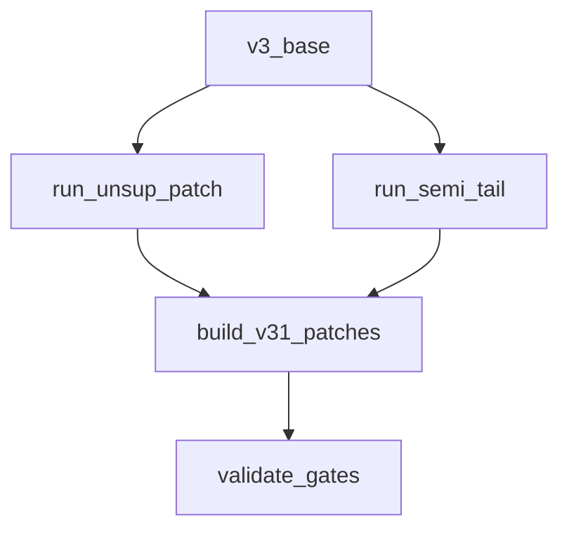
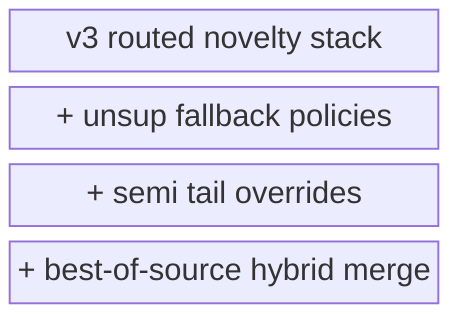
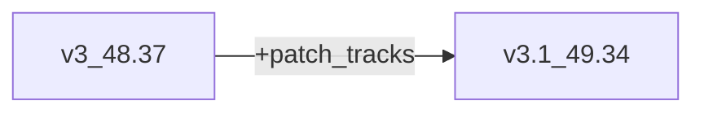
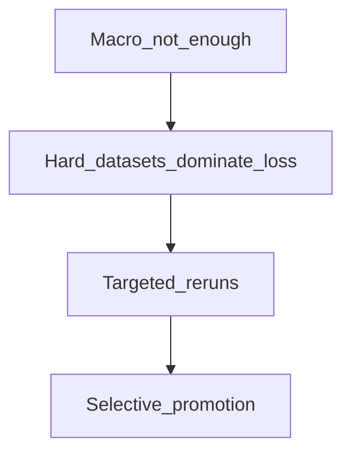

# AdaDDAE v3.1 — Diagram Pack

**Role:** Patch hybrid — unsup fallback + semi tail  
**Combined PR:** 49.34%  
**Artifacts:** `adadae_v31_hybrid`, `adadae_v31_unsup`, `adadae_v31_semi_tail`

---

## 1. System architecture

## 2. Patch merge design

## 3. Training tracks

## 4. Experiment protocol

## 5. Scoring flow (inherits v3)

## 6. Component stack

## 7. Delta vs v3

## 8. Failure-aware design

