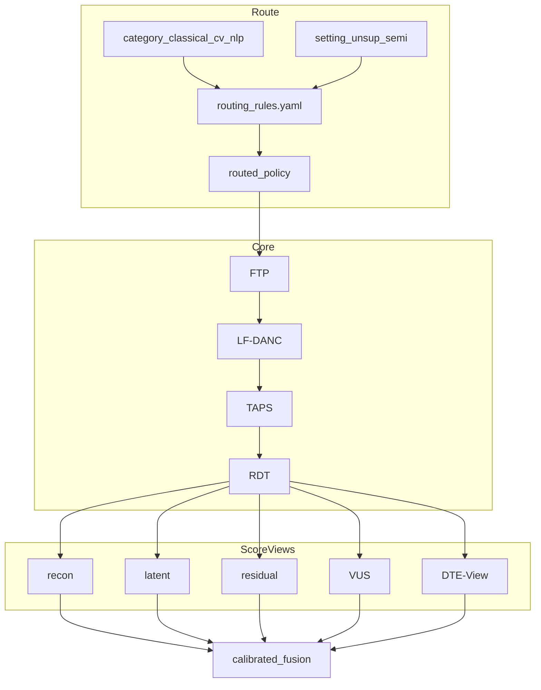
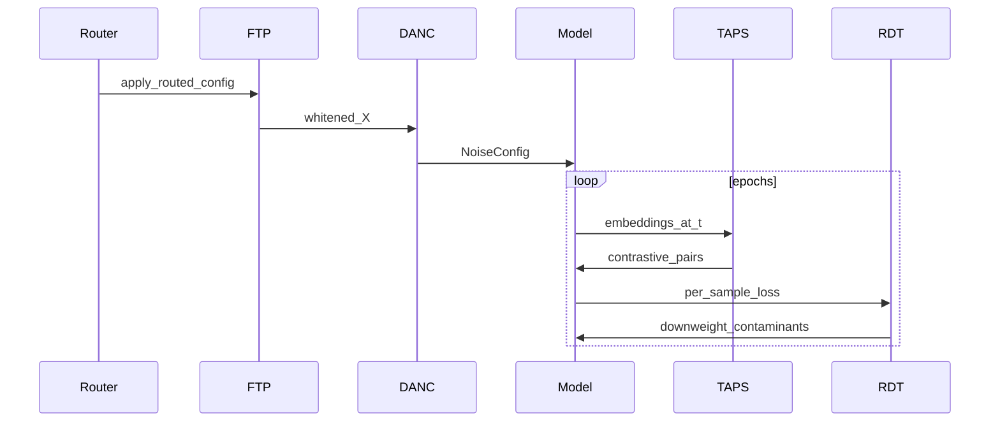
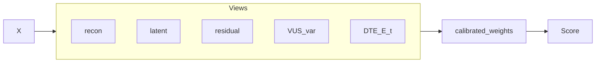
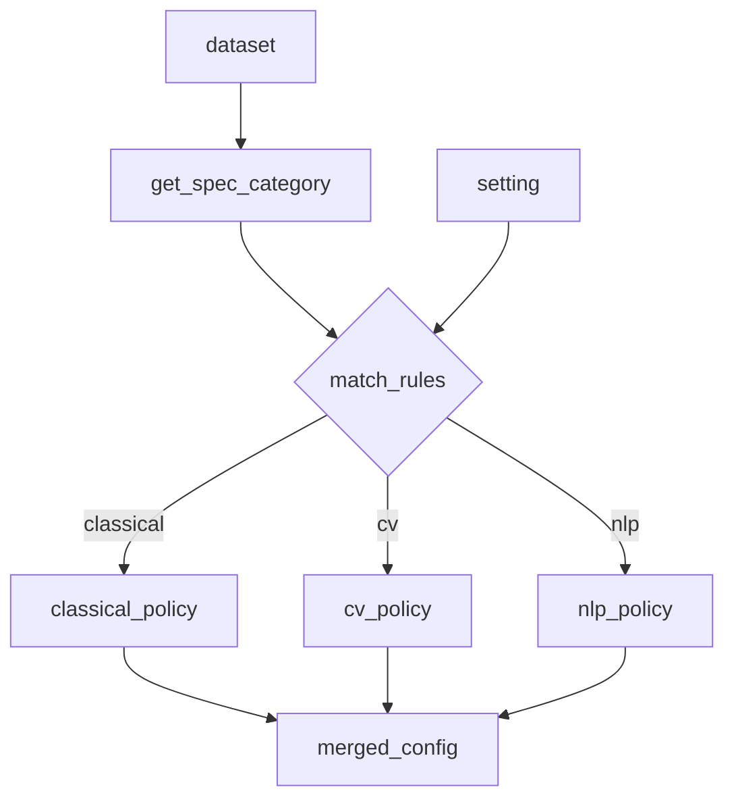
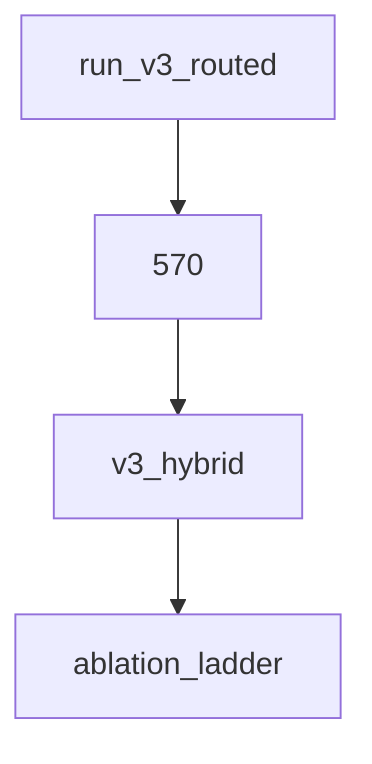
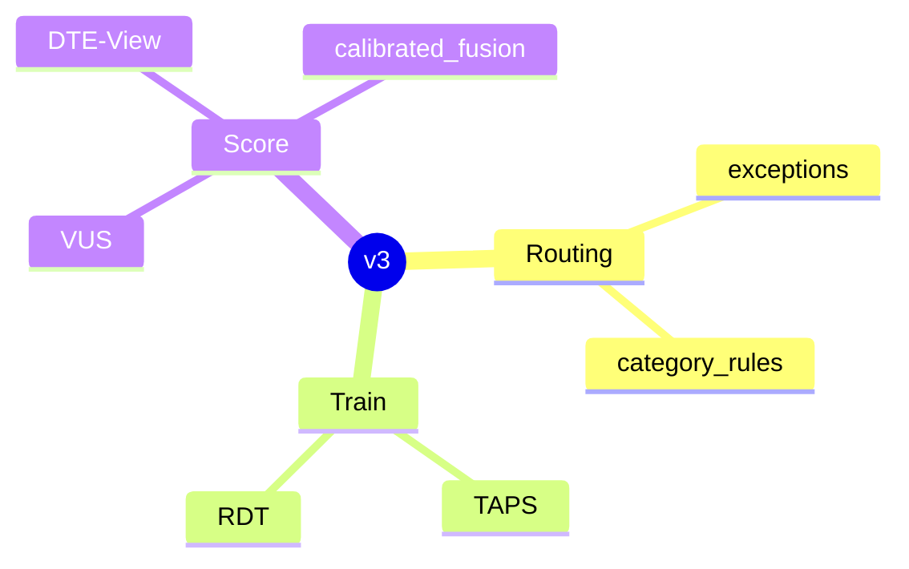
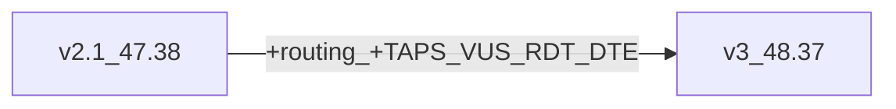

# AdaDDAE v3 — Diagram Pack

**Role:** Policy routing + full named novelty stack  
**Combined PR:** 48.37%  
**Artifact:** `results/adadae_v3_hybrid/` · also `adadae_v3_routed`

---

## 1. System architecture

## 2. Training pipeline

## 3. Inference / multiview scoring

## 4. Routing design

## 5. Experiment protocol

## 6. Component stack

## 7. Delta vs v2.1

