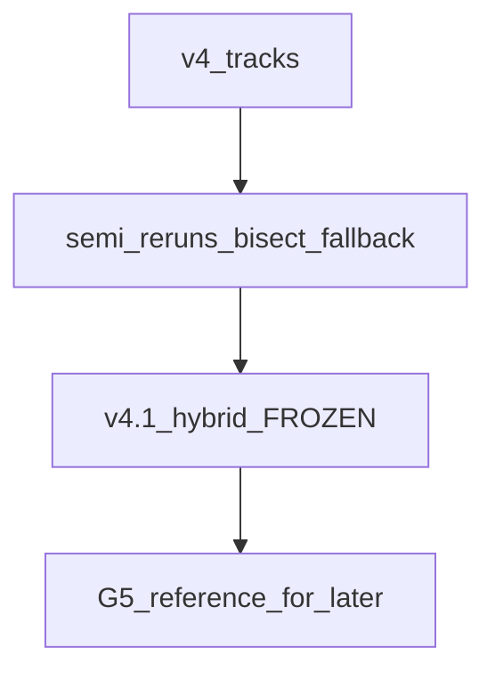
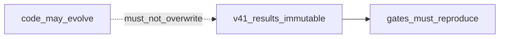
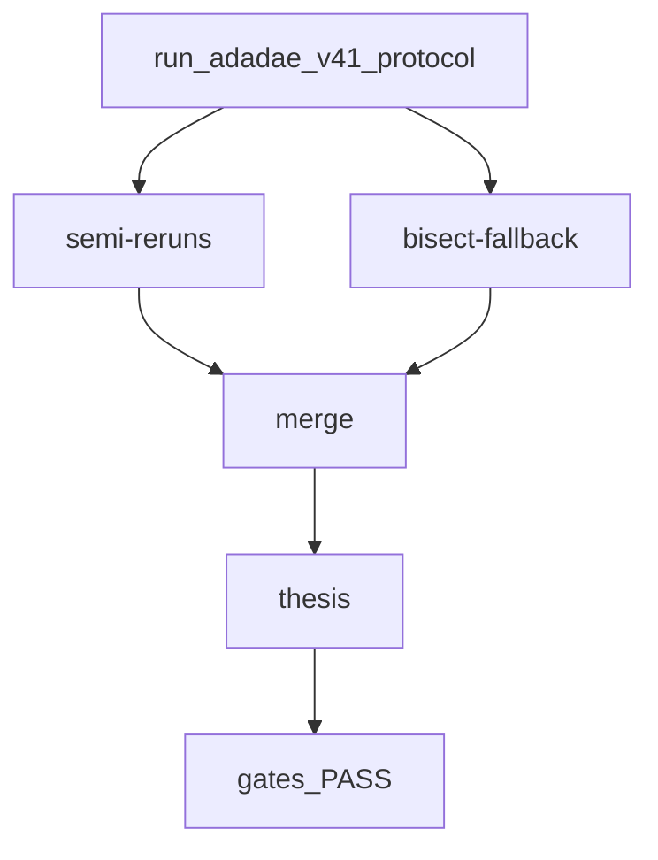
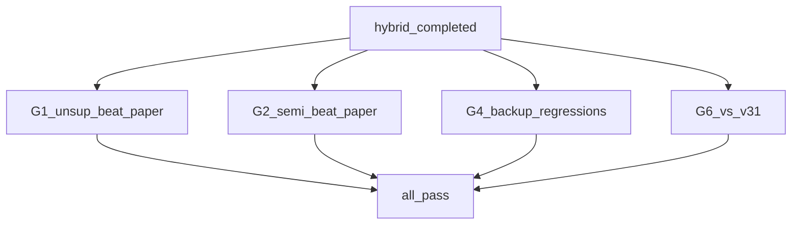
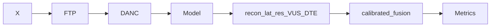
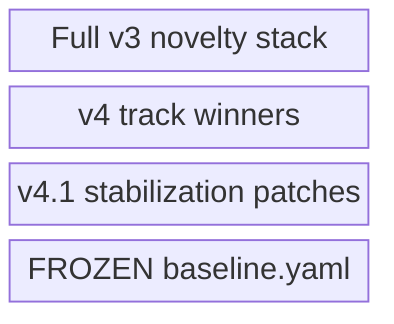
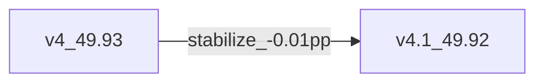
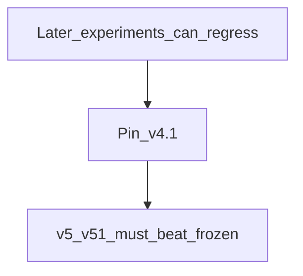

# AdaDDAE v4.1 — Diagram Pack

**Role:** Frozen thesis baseline (immutable reference)  
**Combined PR:** 49.92%  
**Artifact:** `results/adadae_v41_hybrid/` · `configs/baseline_v41.yaml`

---

## 1. System architecture (frozen)

## 2. Freeze contract

## 3. Training / protocol flow

## 4. Evaluation gates design

## 5. Scoring stack (production v4.1)

## 6. Component stack

## 7. Delta vs v4

## 8. Why freeze

