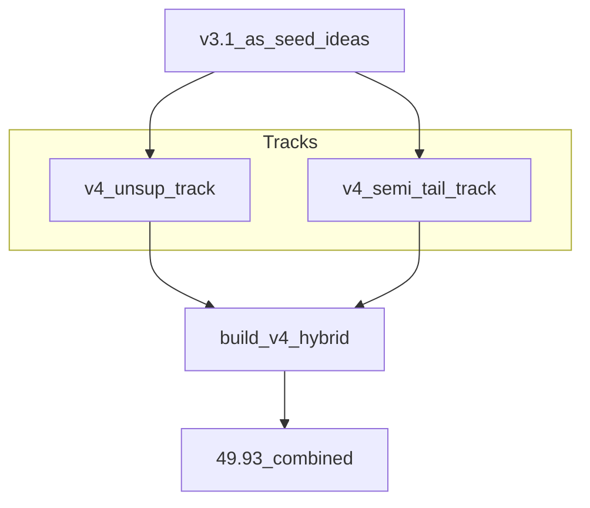
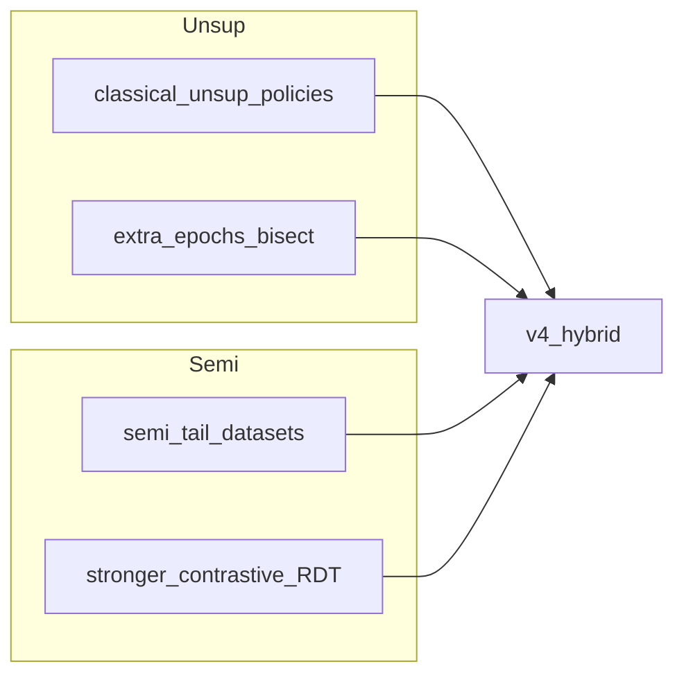
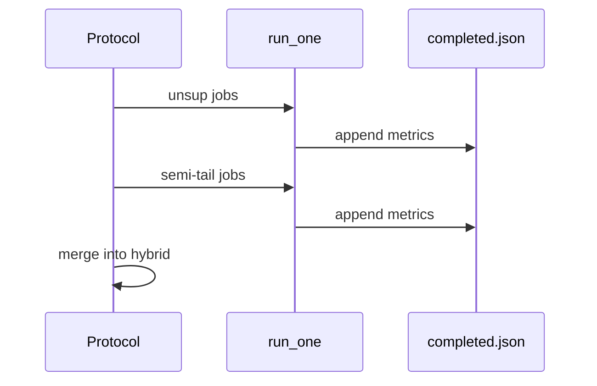
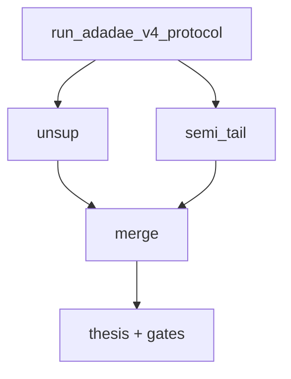
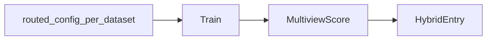
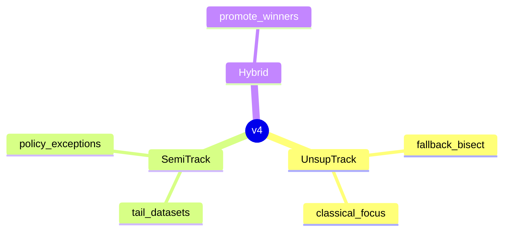
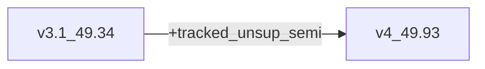
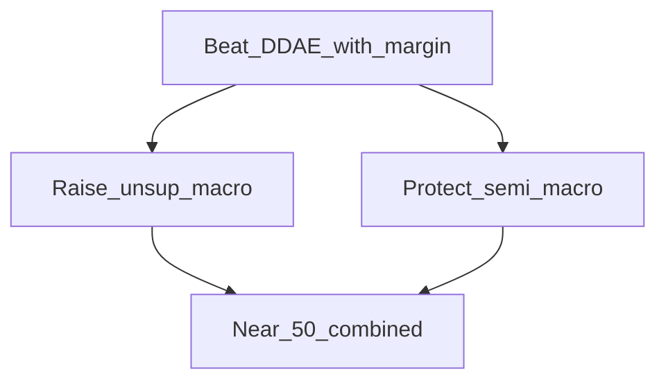

# AdaDDAE v4 — Diagram Pack

**Role:** Dedicated unsup + semi tracks  
**Combined PR:** 49.93%  
**Artifacts:** `adadae_v4_hybrid`, `adadae_v4_unsup`, `adadae_v4_semi_tail`

---

## 1. System architecture

## 2. Track design

## 3. Training flow per track

## 4. Experiment protocol

## 5. Inference flow

## 6. Component stack

## 7. Delta vs v3.1

## 8. Design goal

