# AdaDDAE v5.1 — Diagram Pack (PRIMARY)

**Role:** Current best / thesis primary  
**Combined PR:** **50.12%** (+0.19 pp vs v4.1)  
**Artifacts:** `adadae_v51_hybrid`, `_mce`, `_smc`, `_gate`, `_phase1`  
**Gates:** ALL PASS (G5 strict, G9 merge audit)

---

## 1. System architecture

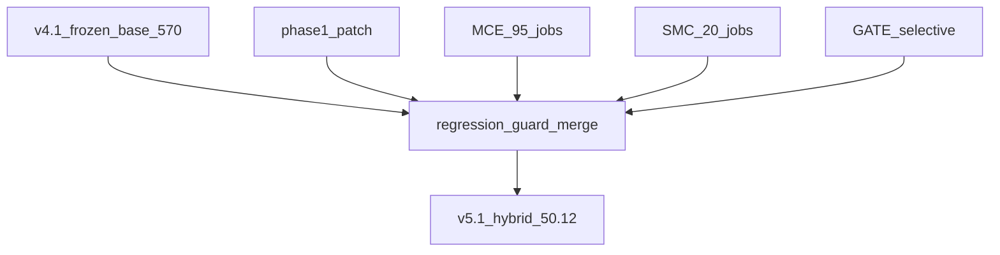

## 2. Layered merge design

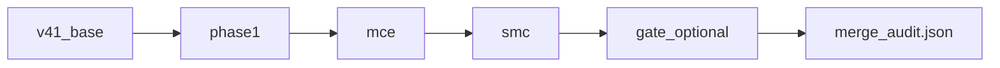

## 3. Regression guard flow

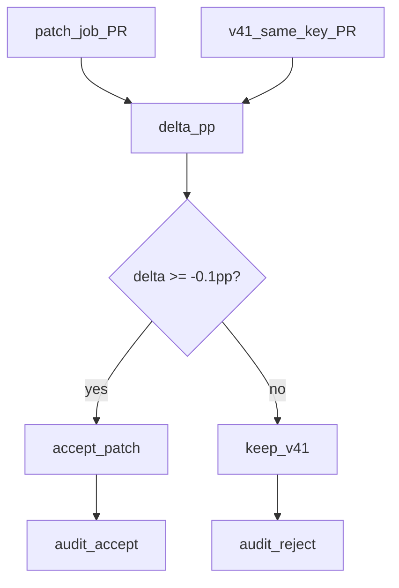

## 4. MCE track design

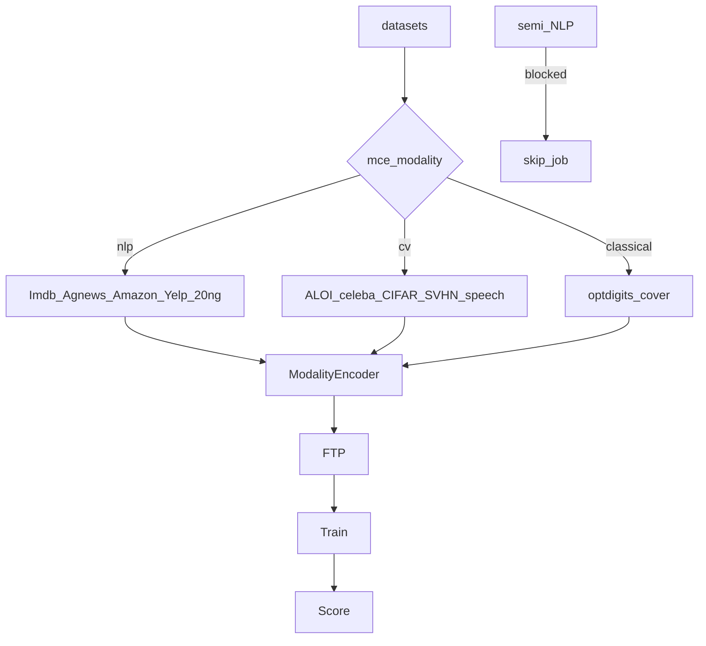

## 5. SMC track design

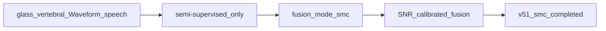

## 6. GATE v2 design (safe)

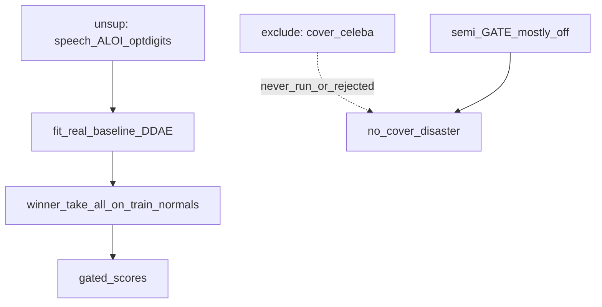

## 7. Training pipeline (single job)

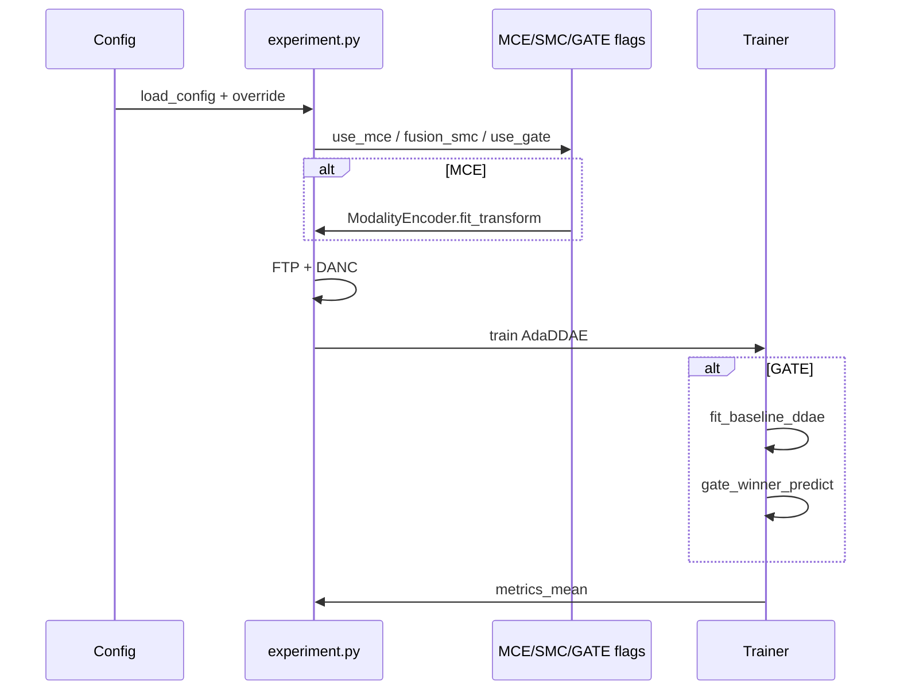

## 8. Inference / scoring flow

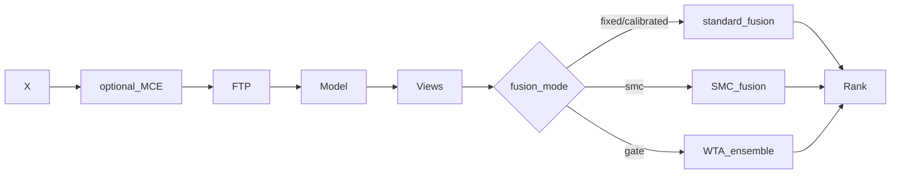

## 9. Vast protocol flow

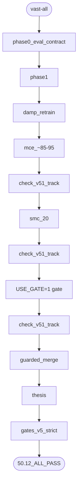

## 10. Merge audit summary

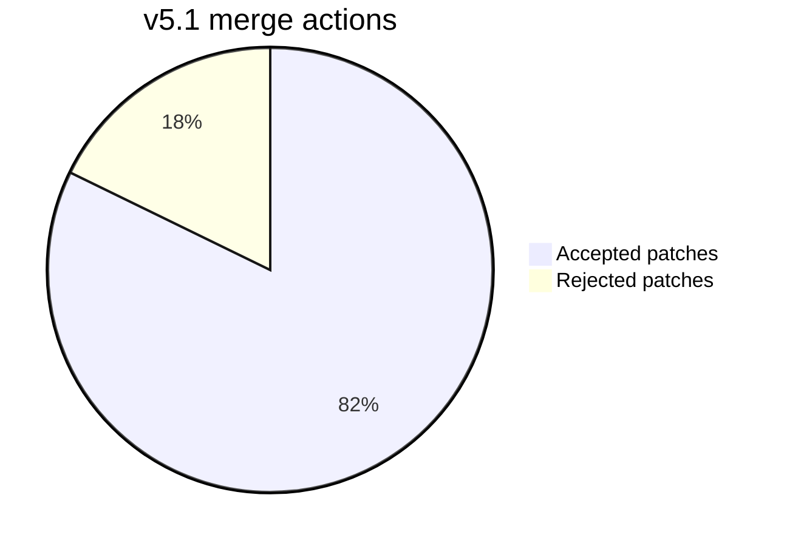

## 11. Win sources (design attribution)

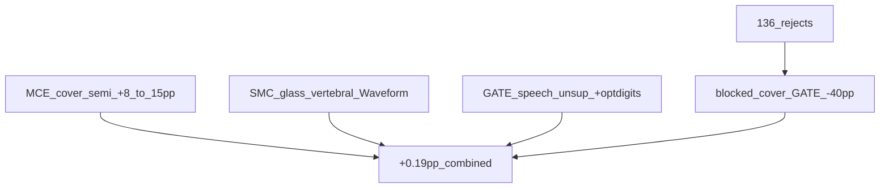

## 12. Component stack

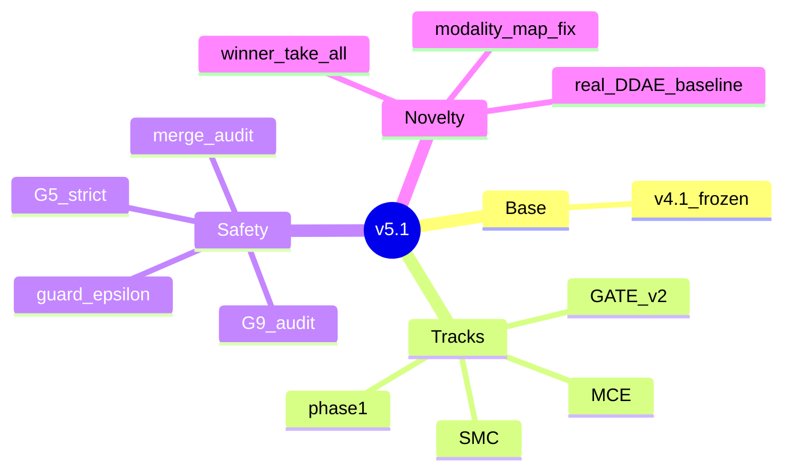

## 13. Delta vs v4.1 / v5

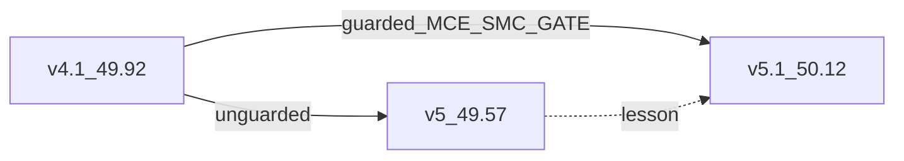

## 14. Gates flowchart

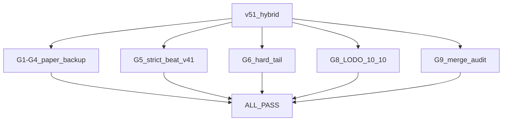

## 15. Thesis framing

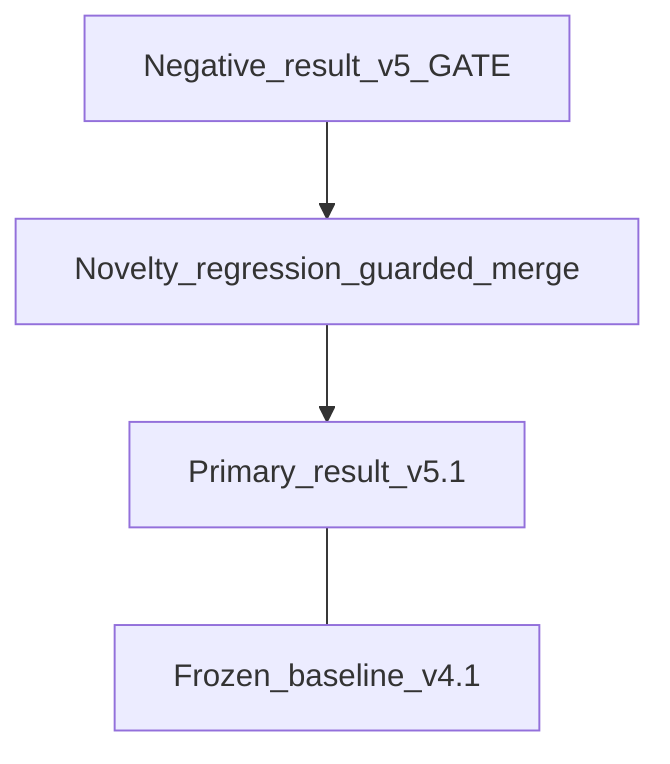
