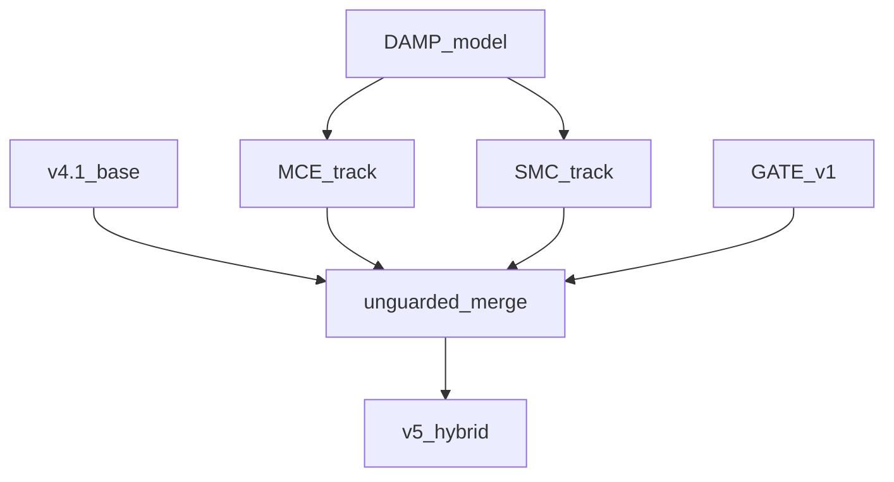
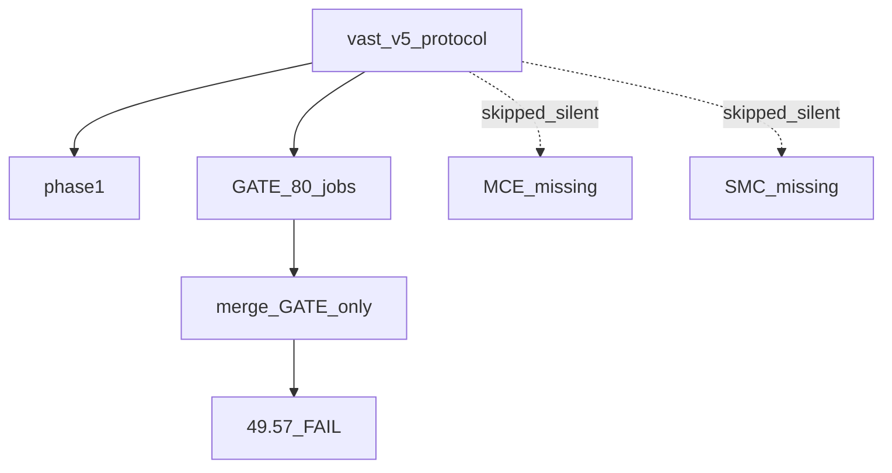
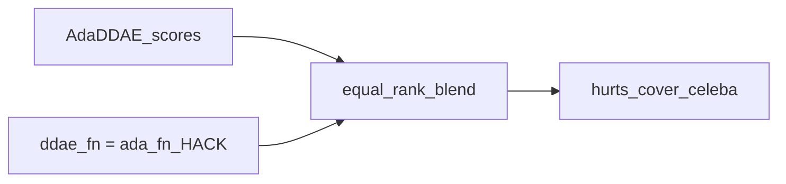
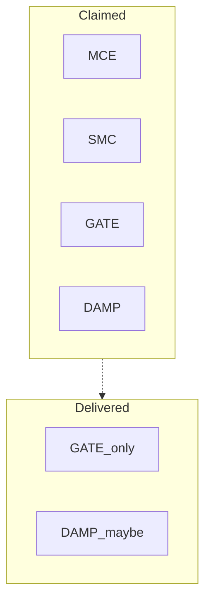
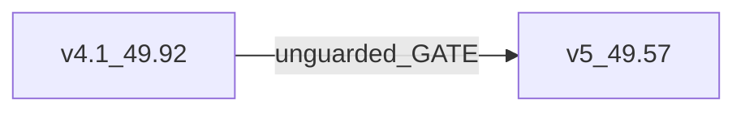

# AdaDDAE v5 — Diagram Pack (Failed GATE Merge)

**Role:** First adaptive-track attempt; **negative result**  
**Combined PR:** 49.57% (−0.35 pp vs v4.1)  
**Artifacts:** `adadae_v5_hybrid`, `adadae_v5_gate`, `adadae_v5_phase1`  
**Missing:** MCE/SMC never ran

---

## 1. Intended architecture



## 2. What actually ran



## 3. GATE v1 design (flawed)



## 4. Failure analysis flow

```mermaid
flowchart TD
  Cover[cover_semi_-18.9pp]
  Celeba[celeba_regressions]
  CIFAR[CIFAR10_hurt]
  Root1[no_regression_guard]
  Root2[||_true_hides_MCE_SMC]
  Root3[wrong_modality_map]
  Cover --> Root1
  Celeba --> Root1
  CIFAR --> Root1
  Root2 --> Missed[no_MCE_SMC_gain]
  Root3 --> BadMCE[would_have_hurt_classical]
```

## 5. Experiment protocol (broken)

```mermaid
flowchart LR
  Loop[for_job_in_MCE] -->|job_||_true| Cont[continue]
  Cont --> Silent[0_jobs_recorded]
```

## 6. Component stack (claimed vs delivered)



## 7. Delta vs v4.1



## 8. Lesson diagram → v5.1

```mermaid
flowchart TB
  Neg[Document_negative_result]
  Neg --> Guard[Add_regression_guard]
  Neg --> Loud[Remove_||_true]
  Neg --> FixMod[Fix_MCE_modality]
  Neg --> GateV2[Selective_GATE_v2]
  Guard & Loud & FixMod & GateV2 --> V51[v5.1]
```
