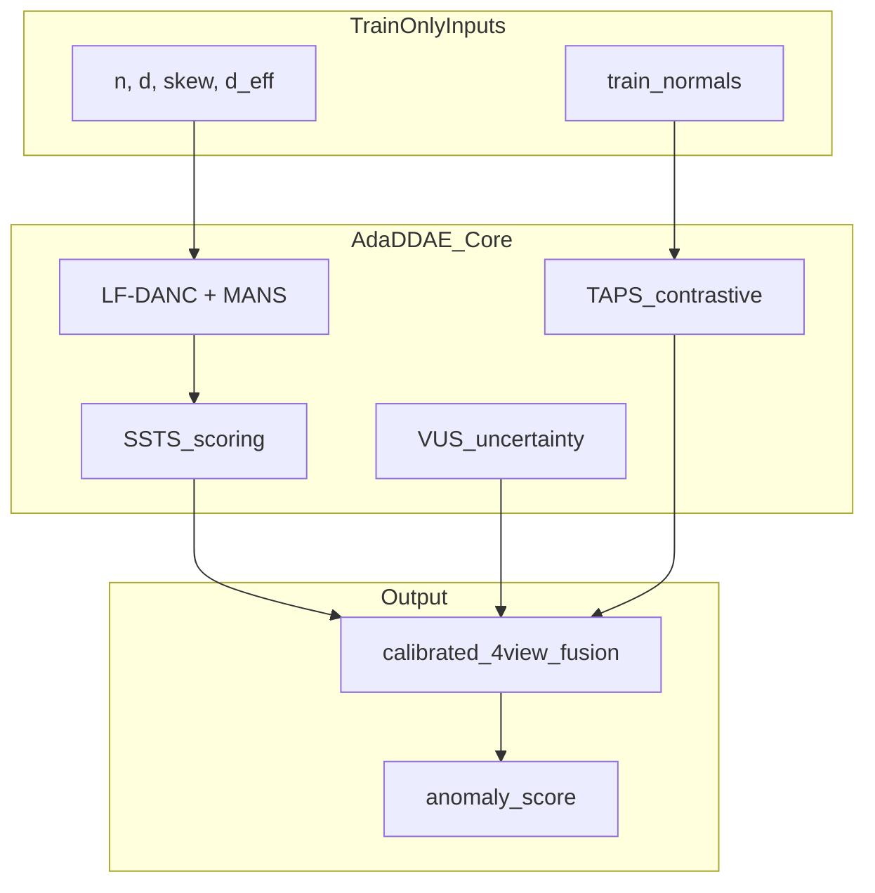

# AdaDDAE Novelty Showcase

## Problem

DDAE (KDD 2025) applies a **fixed global diffusion schedule** per learning paradigm across 57 heterogeneous ADBench datasets. The paper itself shows that optimal noise levels differ by setting and timestep — and calls for **adaptive scheduling** as future work.

AdaDDAE is a **train-only adaptive framework** that answers that call with named, equation-backed components.

---

## Framework overview



---

## Named contributions

| Acronym | Full name | What DDAE lacks | Key equation |
|---------|-----------|-----------------|--------------|
| **FTP** | Feature Tuning Pipeline | Leak-safe PCA/scaler per dataset | Whitening when \(d \gg n_{\text{eff}}\) |
| **LF-DANC** | Label-Free Dataset-Adaptive Noise Controller | Uses no labels for schedule | \(\hat{c}\) from robust z-score tail rate |
| **MANS** | Manifold-Aligned Noise Schedule | Fixed \(\beta_{\text{end}}\) | \(\beta^* = \beta_0(1 + \log(1 + d_{\text{eff}}/d))\) |
| **SSTS** | SNR-Stratified Timestep Selection | Full-sum or uniform \(t\) | Importance sampling on \(\bar{\alpha}_t\) |
| **TAPS** | Timestep-Adaptive Pair Sampling | Random batch shuffle pairs | Semi: normal-only positives; unsup: same-\(t\) |
| **VUS** | Variance-Uncertainty Score | Single-noise reconstruction only | \(\mathrm{Var}_\epsilon[\|x_0-\hat{x}_0\|]\) |
| **RDT** | Rejection-aware Diffusion Training | Trains on all points equally | Down-weight high-loss contamination |
| **DTE-proxy** | DTE-inspired time / kNN score (proxy) | Reconstruction sum only (DDAE Eq. 6) | Soft \(\widehat{\mathbb{E}}[t \mid x]\) + kNN latent distance — **not** full ICLR 2024 DTE |

---

## LF-DANC + MANS (schedule adaptation)

**Terminal SNR target:**

\[
T^* = \min\{T : \bar{\alpha}_T \leq \tau_{\text{snr}}^*\}, \quad
\tau_{\text{snr}}^* = \tau_0 \cdot (1 + \mathbb{1}_{\text{semi}} \cdot \hat{c})
\]

**Manifold-aligned noise budget:**

\[
\beta_{\text{end}}^* = \beta_0 \cdot \Big(1 + \log(1 + d_{\text{eff}}/d)\Big)
\]

- `danc_contamination_mode: label_free` (default) — no labels used
- `oracle` — uses true contamination (ablation upper bound only)

---

## SSTS (scoring as importance sampling)

DDAE sums over all \(t\). AdaDDAE selects \(\mathcal{T}^*\) by **weighted quantile stratification** on \(\bar{\alpha}_t\), then applies SNR-aligned weights:

| Setting | Weight \(w_t\) |
|---------|----------------|
| Unsupervised | \(\propto (1 - \bar{\alpha}_t)\) |
| Semi-supervised | \(\propto \bar{\alpha}_t\) |

Config: `scs_selection: snr_stratified` (default) vs `linspace` (ablation).

---

## TAPS (contrastive v3)

| Setting | Positive pair | Negative |
|---------|---------------|----------|
| Semi-supervised | \(z_0^{(i)}\) paired with \(z_0^{(j)}\) from **training normals only** | \((z_0, z_t)\) same sample |
| Unsupervised | Same-batch pairing at shared corruption \(t\) | Hard negative at high \(t\) |

Contrastive strength scales with SNR: \(\alpha_{\text{eff}} = \alpha_0 \cdot (t/T) \cdot w_t\).

---

## VUS (4th scoring view)

\[
s_{\text{var}}(x_0) = \sum_{t \in \mathcal{T}^*} w_t \cdot \mathrm{Var}_{\epsilon}\big[\|x_0 - \hat{x}_0(x_t^{(\epsilon)})\|_2\big]
\]

Anomalies are **unstable under noise resampling**; normals reconstruct consistently. Fused with calibrated \(\lambda_{\text{var}}\).

---

## Fair comparison statement

| Held equal | Status |
|------------|--------|
| ADBench 57 datasets, splits, seeds | Yes |
| PR-AUC / ROC-AUC metrics | Yes |
| No test-set model selection / early stop | Yes — val carved from train; `early_stop_metric: val_loss` |
| Per-dataset manual hyperparameter search | No — one frozen YAML for all datasets |
| Per-dataset routed specialists / guarded merge | No — appendix / development history only |

**Primary claim:** AdaDDAE (`configs/adadae_final.yaml`, run_id `adadae_final`) improves mean metrics with **one train-only adaptive recipe** shared by all 57 datasets — not by oracle routing or test-PR merges.

**Ablation ladder** isolates each component:

```
ddae_repro → adadae_fixed → +ftp → +lfdanc → +ssts → +rdt → +taps → +vus → +dte_proxy → full_adadae
```

**RDT** (TabADM-inspired): reject likely anomalies during training via loss quantile weighting.

**DTE-proxy:** 5th fusion view from a reconstruction-softmax time estimate plus kNN latent distance ([`src/models/dte.py`](../src/models/dte.py)). Inspired by [DTE (ICLR 2024)](https://arxiv.org/abs/2305.18593); **not** a reimplementation of the full DTE diffusion estimator.

Claims ↔ code: [`thesis/claims_code_map.md`](claims_code_map.md).

Run:

```bash
python scripts/assert_final_config.py --config configs/adadae_final.yaml
python scripts/showcase_novelty.py --epochs 20
python scripts/ablations.py --steps ddae_repro lfdanc ssts full_adadae oracle_danc
python scripts/profile_job.py
```

---

## Expected ablation story

| Component | Expected effect |
|-----------|-----------------|
| FTP | Helps high-\(d\) / skewed tabular sets |
| LF-DANC + MANS | Largest gain on heterogeneous \(n, d\) mix |
| SSTS | Efficiency + aligns with paper Fig. 6 |
| TAPS | Semi-supervised gains (normal-only pairs) |
| VUS | Marginal + on noisy / ambiguous anomalies |

Hard datasets (e.g. ALOI unsupervised) may remain difficult — disclose in thesis limitations.

---

## Development history (appendix only — not primary Table 1)

Earlier tracks (v2–v5.1 hybrids, `policy: routed`, `policy_exceptions.yaml`, MCE/SMC/GATE, `merge_v5_guarded.py`) were used for **exploration**. They must not be presented as “the AdaDDAE model.” Primary numbers come only from `results/adadae_final/` after a full 570-job run under val-only early stopping, paired with `results/ddae_baseline_valstop/` (or equivalent fair DDAE).

### Why hybrids were demoted

- Per-dataset exceptions / oracle routing select specialists after looking at outcomes.
- Guarded merge accepted patches using test PR deltas.
- Test-label early stopping in older `fit()` selected checkpoints with test PR-AUC.

Those practices invalidate a single-method claim even when individual jobs are real.

### Negative results (keep in thesis)

- Monolithic early GPU stack regressions on some families
- VUS / blanket FTP+TAPS / SSTS harms on specific datasets (document, don’t patch into primary)
- Proxy DTE ≠ full ICLR 2024 DTE — state the gap explicitly

---

## AdaDDAE-2 (Table 2 — advanced frozen recipe)

Under the **same integrity rules** (one recipe, val-only stop, no routing/merge):

| Module | Role |
|--------|------|
| **CHRONOS** | Shared schedule hypernet from train meta |
| **GEODE** | Local PCA off-manifold latent residual |
| **CALIX** | Conformal / quantile multi-view fusion |
| **NEXUS** | VICReg SSL normality prior |
| **AETHER** | DSM train loss + energy path score |

Config: [`configs/adadae2_final.yaml`](../configs/adadae2_final.yaml). Run: `bash scripts/run_adadae2_protocol.sh all 16gb` on Vast after Table 1.

---

## AdaDDAE-5 (Table 5 — information-geometric breakthrough)

Industry diffusion-AD mostly does fixed schedule → reconstruct → sum MSE. AdaDDAE-5 treats the diffusion path as an **information-geometry probe** of the normal manifold, then scores with geometry-aware residuals and train-only calibrated extremes — still one frozen YAML, no test labels, no routing.

| Module | Role |
|--------|------|
| **FIGARO** | Fisher-proxy adaptive \(T^*,\beta^*\) |
| **DSM+** | Joint recon + denoising score matching |
| **MAHALA** | Shrinkage Mahalanobis on residual⊕latent |
| **FULL-DTE** | Sharpened soft posterior over \(t\) (+ kNN) |
| **LEXICON** | Dirichlet fusion from train rank consistency |
| **PURA** | Positive-unlabeled risk weights (label-free \(\hat\pi\)) |
| **EVT-TAIL / CONFAL** | Extreme-value + conformal score maps (train-only) |
| **SPECTRA / SINKHORN** | Spectral FTP channels + OT geometry score |
| **IB / ELBO-S / CURRICULUM / vMF** | Representation pressure + ELBO view + SNR curriculum |

Config: [`configs/adadae5_final.yaml`](../configs/adadae5_final.yaml). Run: `bash scripts/run_adadae5_protocol.sh all 16gb` after fair DDAE (+ ideally Table 1). See [`FINAL_RUN.md`](../FINAL_RUN.md).

---

## AdaDDAE-6 (Table 6 — ADBench regime stack)

Ten analysis loops over ADBench regimes (tiny/huge/rare/high-d/CV-NLP/skew/…) mapped to complementary modules on the **A5 integrity core** — not a re-enable of demoted A3 kitchen-sink. Catalog: [`adbench_improve_catalog.md`](adbench_improve_catalog.md).

| Module | Role |
|--------|------|
| **HELIX** | Train-only linear vs cosine schedule family |
| **DELTA** | LF contamination sandwich → τ retune |
| **APEX** | Contam-aware rare-tail map (after EVT→CONFAL) |
| **NAUTILUS / TORQUE** | Tiny-n shrink / huge-n caps |
| **ORBIT / LOCUS / SPIRAL** | Cosine residual, latent LOF, reverse consistency views |
| **KALE / RIDGE** | Conflict-aware fusion + Huber recon |

Config: [`configs/adadae6_final.yaml`](../configs/adadae6_final.yaml). Run: `bash scripts/run_adadae6_protocol.sh all 16gb` after Tables 1–5. Proxies only — not formal conformal coverage or full reverse SDE.

