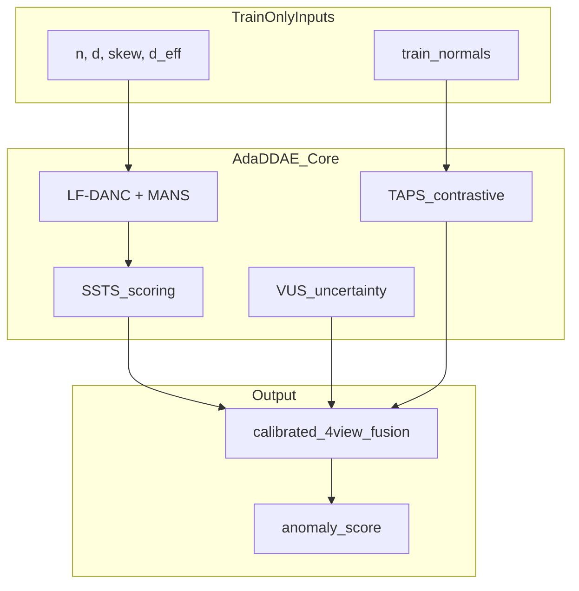

# AdaDDAE Novelty Showcase

## Problem

DDAE (KDD 2025) applies a **fixed global diffusion schedule** per learning paradigm across 57 heterogeneous ADBench datasets. The paper itself shows that optimal noise levels differ by setting and timestep — and calls for **adaptive scheduling** as future work.

AdaDDAE is a **train-only adaptive framework** that answers that call with named, equation-backed components.

---

## Framework overview



---

## Named contributions

| Acronym | Full name | What DDAE lacks | Key equation |
|---------|-----------|-----------------|--------------|
| **FTP** | Feature Tuning Pipeline | Leak-safe PCA/scaler per dataset | Whitening when \(d \gg n_{\text{eff}}\) |
| **LF-DANC** | Label-Free Dataset-Adaptive Noise Controller | Uses no labels for schedule | \(\hat{c}\) from robust z-score tail rate |
| **MANS** | Manifold-Aligned Noise Schedule | Fixed \(\beta_{\text{end}}\) | \(\beta^* = \beta_0(1 + \log(1 + d_{\text{eff}}/d))\) |
| **SSTS** | SNR-Stratified Timestep Selection | Full-sum or uniform \(t\) | Importance sampling on \(\bar{\alpha}_t\) |
| **TAPS** | Timestep-Adaptive Pair Sampling | Random batch shuffle pairs | Semi: normal-only positives; unsup: same-\(t\) |
| **VUS** | Variance-Uncertainty Score | Single-noise reconstruction only | \(\mathrm{Var}_\epsilon[\|x_0-\hat{x}_0\|]\) |
| **RDT** | Rejection-aware Diffusion Training | Trains on all points equally | Down-weight high-loss contamination |
| **DTE-View** | Diffusion Time Posterior Score | Reconstruction sum only (DDAE Eq. 6) | \(\mathbb{E}[t \mid x_0]\) from [DTE ICLR 2024](https://arxiv.org/abs/2305.18593) |

---

## LF-DANC + MANS (schedule adaptation)

**Terminal SNR target:**

\[
T^* = \min\{T : \bar{\alpha}_T \leq \tau_{\text{snr}}^*\}, \quad
\tau_{\text{snr}}^* = \tau_0 \cdot (1 + \mathbb{1}_{\text{semi}} \cdot \hat{c})
\]

**Manifold-aligned noise budget:**

\[
\beta_{\text{end}}^* = \beta_0 \cdot \Big(1 + \log(1 + d_{\text{eff}}/d)\Big)
\]

- `danc_contamination_mode: label_free` (default) — no labels used
- `oracle` — uses true contamination (ablation upper bound only)

---

## SSTS (scoring as importance sampling)

DDAE sums over all \(t\). AdaDDAE selects \(\mathcal{T}^*\) by **weighted quantile stratification** on \(\bar{\alpha}_t\), then applies SNR-aligned weights:

| Setting | Weight \(w_t\) |
|---------|----------------|
| Unsupervised | \(\propto (1 - \bar{\alpha}_t)\) |
| Semi-supervised | \(\propto \bar{\alpha}_t\) |

Config: `scs_selection: snr_stratified` (default) vs `linspace` (ablation).

---

## TAPS (contrastive v3)

| Setting | Positive pair | Negative |
|---------|---------------|----------|
| Semi-supervised | \(z_0^{(i)}\) paired with \(z_0^{(j)}\) from **training normals only** | \((z_0, z_t)\) same sample |
| Unsupervised | Same-batch pairing at shared corruption \(t\) | Hard negative at high \(t\) |

Contrastive strength scales with SNR: \(\alpha_{\text{eff}} = \alpha_0 \cdot (t/T) \cdot w_t\).

---

## VUS (4th scoring view)

\[
s_{\text{var}}(x_0) = \sum_{t \in \mathcal{T}^*} w_t \cdot \mathrm{Var}_{\epsilon}\big[\|x_0 - \hat{x}_0(x_t^{(\epsilon)})\|_2\big]
\]

Anomalies are **unstable under noise resampling**; normals reconstruct consistently. Fused with calibrated \(\lambda_{\text{var}}\).

---

## Fair comparison statement

| Held equal | Status |
|------------|--------|
| ADBench 57 datasets, splits, seeds | Yes |
| PR-AUC / ROC-AUC metrics | Yes |
| No test-set tuning | Yes |
| Per-dataset manual hyperparameter search | No — deterministic policy |

**Primary claim:** AdaDDAE improves mean metrics by adapting from **train-only dataset characteristics**, not by oracle tuning.

**Ablation ladder** isolates each component:

```
ddae_repro → adadae_fixed → +ftp → +lfdanc → +ssts → +rdt → +taps → +vus → +dte → full_adadae
```

**RDT** (TabADM-inspired): reject likely anomalies during training via loss quantile weighting.

**DTE-View** (ICLR 2024 DTE): 5th fusion view from diffusion time posterior + kNN latent proxy.

Run:

```bash
python scripts/showcase_novelty.py --epochs 20
python scripts/ablations.py --steps ddae_repro lfdanc ssts full_adadae oracle_danc
python scripts/profile_job.py
```

---

## Expected ablation story

| Component | Expected effect |
|-----------|-----------------|
| FTP | Helps high-\(d\) / skewed tabular sets |
| LF-DANC + MANS | Largest gain on heterogeneous \(n, d\) mix |
| SSTS | Efficiency + aligns with paper Fig. 6 |
| TAPS | Semi-supervised gains (normal-only pairs) |
| VUS | Marginal + on noisy / ambiguous anomalies |

Hard datasets (e.g. ALOI unsupervised) may remain difficult — disclose in thesis limitations.

---

## AdaDDAE v3 (dataset-aware routing)

v3 extends v2 family routing with **per-dataset exceptions** backed by oracle ceiling analysis (`scripts/oracle_policy_table.py`).

### v3 policies (`src/policy.py` + `configs/policy_exceptions.yaml`)

| Route | When | Components |
|-------|------|------------|
| `unsup_ssts` | Default unsupervised | LF-DANC + MANS + SSTS + FTP |
| `unsup_baseline_fallback` | vowels, letter, skin, fault, wine, glass | DDAE-faithful (SSTS regressed −35% on vowels) |
| `baseline_ddae` | Semi classical | Pure DDAE repro |
| `semi_cvnlp_ftp` | Semi CV | FTP + fixed T=50, contrastive **off** |
| `semi_nlp_baseline` | Semi NLP | DDAE-faithful (FTP+TAPS hurt Agnews −5.7%) |
| `semi_speech_specialist` | speech semi | RobustScaler + FTP + RDT + T=80 |

### Table-1 results (57 datasets, 5 seeds)

| Model | Unsup PR | Semi PR | vs DDAE unsup | vs DDAE semi |
|-------|----------|---------|---------------|--------------|
| DDAE paper | 32.77% | 61.36% | — | — |
| DDAE baseline 570 | 32.63% | 60.75% | −0.14% | −0.61% |
| AdaDDAE v2 hybrid | 34.01% | 60.61% | **+1.24%** | −0.75% |
| AdaDDAE v2.1 (revert semi CV/NLP) | 34.01% | 60.75% | **+1.24%** | −0.61% |
| AdaDDAE v3 oracle-best | **36.93%** | 60.77% | **+4.16%** | −0.59% |

**v3 oracle ceiling** proves routing alone can reach **+4.16% unsup PR**; semi still needs **+0.59%** from specialists (speech, ALOI) via GPU patch runs.

### Run v3 on Vast

```bash
cd /workspace/ITM/project && git pull origin main
bash scripts/vast_adadae_v2_smoke.sh 12gb   # verify env
bash scripts/v3_hard_bisect.py --hardware 12gb --epochs 100  # hard-dataset matrix
bash scripts/run_adadae_v3_protocol.sh all  # ~100-130 selective jobs
python scripts/validate_gates.py --completed results/adadae_v3_hybrid/metrics/completed.json
```

### Negative results (document in thesis)

- Monolithic `default_gpu`: semi PR **25%** (vs 61% paper)
- VUS on semi classical: **−18.7%** PR on ablation subset
- Blanket FTP+TAPS on NLP semi: Agnews **−5.7%**, 20newsgroups **−2.4%**
- SSTS on vowels/letter unsup: **−35% / −25%** vs baseline

